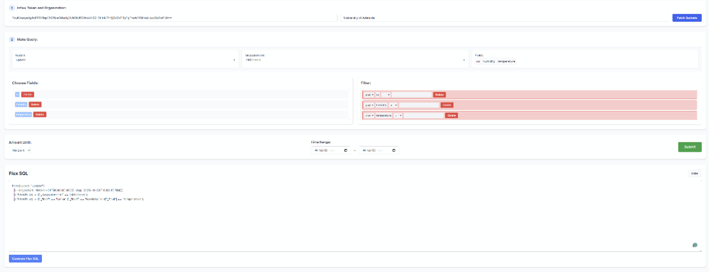
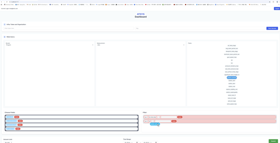
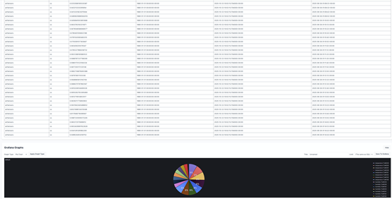
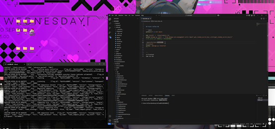

# Django, InfluxDB & Grafana Data Dashboard

A full-stack data management and visualisation platform built with Django, InfluxDB, Grafana and JavaScript.

This project was developed as a university software engineering team project. The application allows users to connect to InfluxDB, build queries through a web interface, retrieve time-series data and visualise the results through integrated Grafana dashboards.

This repository is a portfolio version of the original project and highlights the technical work and features I contributed to.

---

## Project Overview

Working directly with InfluxDB queries can be difficult for users who are not familiar with Flux syntax.

The goal of this project was to provide a web interface that allows users to construct queries through selections and filters rather than writing the complete query manually.

The application connects several components:

```text
User
  │
  ▼
Web Interface
  │
  ▼
Django Backend
  │
  ▼
InfluxDB
  │
  ├── Query Results
  │
  └── Time-Series Data
  │
  ▼
Grafana
  │
  ▼
Charts and Dashboards
```

---

## Main Features

### Visual Query Builder

Users can build an InfluxDB query through the interface by selecting:

- Bucket
- Measurement
- Fields
- Filters
- Time range

The application then automatically generates the corresponding Flux query.



---

### Automatic Flux Query Generation

Instead of requiring users to manually write Flux syntax, the application generates the query based on the options selected in the interface.

The generated query can also be viewed before execution, making it easier to understand and debug the query.

---

### Dynamic Field and Filter Selection

The interface dynamically retrieves available measurements, fields and values from InfluxDB.

Users can add multiple fields and filter conditions to create more complex queries.



---

### Query Result Display

Query results are returned to the web application and displayed in a structured table.

This allows users to inspect the data directly before creating visualisations or exporting the result.



---

### Grafana Integration

Grafana is integrated into the platform to provide data visualisation.

Query results can be represented using graphical dashboards while still allowing users to view the underlying data in the application.

The project included support for displaying Grafana visualisations directly within the web application.

---

### CSV Export

Query result tables can be exported to `.csv` files directly from the user interface.

This allows users to use the retrieved data in other tools for further analysis.

---

## Technologies

### Backend

- Python
- Django
- Django REST framework
- InfluxDB
- REST APIs

### Frontend

- JavaScript
- React
- HTML
- CSS

### Data & Visualisation

- InfluxDB
- Flux
- Grafana
- CSV

### Development

- Git
- GitHub
- Visual Studio Code
- Python virtual environments
- npm

---

## My Contribution

My work on the project included:

- Backend development and project integration
- Working with the InfluxDB API
- Retrieving buckets, measurements, fields and time-series data
- Supporting automatic generation of Flux queries
- Connecting frontend query selections with backend functionality
- Supporting query result processing and display
- Working on Grafana integration
- Supporting CSV export functionality
- Debugging issues across frontend, backend and database components
- Testing features and integrating code produced by different team members
- Maintaining project documentation and participating in sprint development

---

## Development Environment

The project required several services to work together during development, including the Django backend, frontend development server and InfluxDB.



This provided practical experience working with a multi-component application rather than a single standalone program.

---

## How the Query Workflow Works

A typical query follows this process:

```text
1. User provides InfluxDB connection information
        │
        ▼
2. Application retrieves available data structure
        │
        ▼
3. User selects bucket and measurement
        │
        ▼
4. User selects fields and filters
        │
        ▼
5. Application generates a Flux query
        │
        ▼
6. Django sends the query to InfluxDB
        │
        ▼
7. Query results are returned
        │
        ├── Display as a table
        ├── Export as CSV
        └── Visualise using Grafana
```

---

## Screenshots

### Development Environment

The project running locally with the development services and source code.


### Data Dashboard

The main dashboard used to select InfluxDB data and build a query.


### Query Results and Visualisation

Query results displayed as a table together with an integrated Grafana visualisation.


### Query Builder and Generated Flux

Dynamic field selection, filters and automatically generated Flux query.


---

## Repository Structure

```text
django-influxdb-grafana-project/
│
├── backend/
│   ├── backend/
│   ├── influxdb/
│   ├── users/
│   ├── manage.py
│   └── requirements.txt
│
├── frontend/
│   ├── public/
│   ├── src/
│   ├── package.json
│   └── vite.config.js
│
├── sample_data/
│
├── screenshots/
│   ├── snapshot1.png
│   ├── snapshot2.png
│   ├── snapshot3.png
│   └── snapshot4.png
│
├── .gitignore
└── README.md
```

---

## What I Learned

This project gave me practical experience in building and integrating a full-stack data application.

In particular, I gained experience with:

- Building backend functionality with Django
- Working with REST APIs
- Querying a time-series database
- Connecting frontend controls with backend services
- Automatically generating database queries
- Integrating external visualisation tools
- Debugging issues across multiple application layers
- Working collaboratively using Git and GitHub

The project also helped me understand how frontend applications, backend services, databases and visualisation platforms work together as one system.

---

## Project Note

This was originally developed as a university team project.

This repository is presented as a portfolio version of the project and includes work relevant to my own contribution. Development credentials, private configuration, virtual environments and other sensitive or unnecessary files are not included.